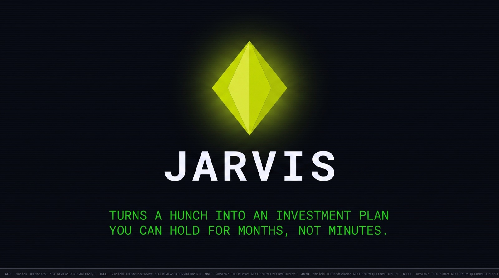
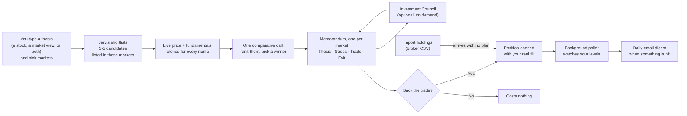
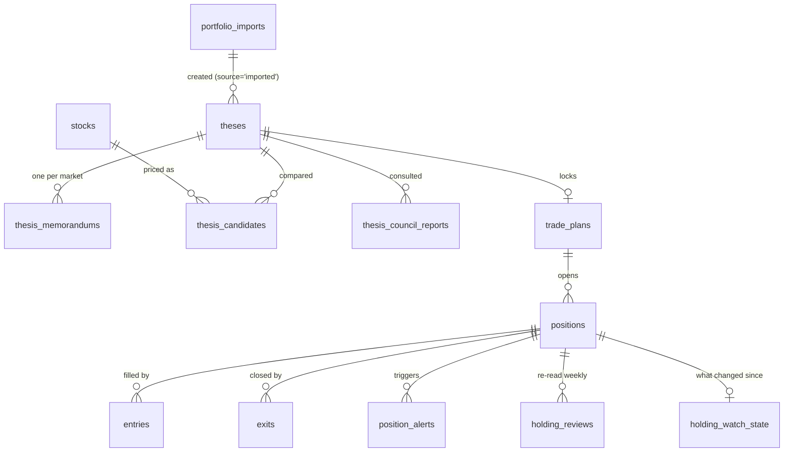

<p align="center">
  
</p>

<h1 align="center">Jarvis Decision Cockpit</h1>

<p align="center">
  <strong>Turns a hunch into an investment plan you can hold for months, not minutes.</strong>
</p>

<p align="center">
  <a href="https://github.com/harshf15-code/Jarvis_Investment_Thesis_Validator/actions/workflows/ci.yml"></a>
  
  <a href="LICENSE"></a>
  
  
</p>

---

You give it a thesis in plain English — *"NBFCs have all-time-low NPAs, I think they run
this year"* — pick the markets to run it against, and it returns a complete investment
memorandum: every candidate priced and compared head-to-head, a winner, four ways the trade
could fail, a costed trade plan, and the exit rules. You can then convene a **council of
investing personas** to argue with the result before you commit a rupee. Then it watches the
market and emails you when a level is hit.

> **This is decision support, not a broker.** It never places an order, never touches a
> brokerage account, and never moves money. It is not investment advice. Every number it
> produces comes from a language model and should be treated as a starting point for your
> own judgement, not an answer. See [Disclaimer](#disclaimer).

---

## What it actually does

Most "AI trading" tools either give you a chat window or a black-box signal. This does
neither. It runs a fixed analytical workflow — thesis → stress test → trade plan → exit
discipline — and makes the model show its work at every step.

**The core loop:**



The key design decision: **you never pick from a list of names the system hasn't
analysed.** A macro thesis gets a basket Jarvis chooses and prices. A thesis that already
names a stock gets that stock *plus its closest peers* — because "should I buy this one"
is only answerable against the alternatives.

### Markets

A thesis is run against markets you choose, and **each market gets its own memorandum**.
"The best robotics name in India" and "…in the US" are different questions with different
answers, so they are asked separately and priced separately.

| Market | Status | Exchanges |
|---|---|---|
| United States | Live | US |
| India | Live | NSE, BSE |
| China · Europe · Emerging Markets | Visible, disabled | — |

The three disabled markets are deliberate, not unfinished. Every price now carries the currency
it was quoted in, so a ¥6,052 quote would at least be labelled as yuan — but labelling is not
listing. Nothing can resolve one of those names in the first place: there is no exchange code for
SSE, LSE or XETRA, no Yahoo suffix to build from one, and no trading session to know when the
market is open. Each is real work with real per-exchange testing behind it. A half-priced report
is worse than no report.

The market you pick is also the **universe the shortlist is held to**. Every name the model
returns is re-checked against that market's exchanges after the fact, and one retry names the
rejected tickers so it cannot re-roll the same foreign listings. This is not decoration: a
robotics thesis once came back comparing two US names against three unpriceable Japanese ones,
and the winner was simply whoever survived.

### The Investment Council

A memorandum is one model's take, shown with total confidence. The Council is the second opinion
— and deliberately several of them, so that **disagreement is visible rather than averaged away**.

You keep a roster of up to seven personas in Settings (three ship by default), pick at least
three at consult time, and each one reads the same memorandum and the same priced grid, then
gives its own verdict — including naming a different winner, or none of the field. One further
call synthesizes where they agreed and where they split.

> Every persona is an **AI simulation** based on a publicly known investing philosophy — not the
> real person's opinion, and not affiliated with or endorsed by them. That line appears on every
> surface a persona's name shows up on.

A consult costs **N + 1 model calls** and zero market-data lookups; the member calls run in
parallel, so a seven-member panel takes about as long as a three-member one. If one member's call
fails, its card says so and the rest of the report still renders.

### The memorandum

One screen, produced in a single pass:

| Tab | Contains |
|---|---|
| **Thesis** | Market view, the mispricing, catalysts, *why not the others* (per-peer teardown), time horizon and invalidation, conviction score, secondary pick |
| **Stress Test** | Four concrete failure modes, each paired with an honest counter-argument — and a verdict on whether the bear case holds |
| **Trade Plan** | Nine-cell grid (CMP, entry zone, add tranche, stop, two targets, size, horizon, time exit), a thesis test calendar, and an optional parallel entry |
| **Exit** | Five sequenced rules (trim, trim, runner, hard stop, time exit), the one *anchor metric* to track, and risk/reward, max drawdown, tier and PEG |
| **Council** | Appears once consulted: the combined verdict, where the panel agreed and split, then one card per member with their verdict, the name they'd own, and the single risk they'd flag |

Above them sits a comparative grid: up to five names side by side with live price,
valuation multiple, 52-week range position, market cap, and a BUY/WATCH/AVOID call.

### After you back a trade

Backing a trade records your **actual fill** — price, quantity, date — not the entry zone
the model proposed. From there the app tracks the position, computes weighted-average
entry across tranches, logs exits, and keeps a trade journal so you can review whether
the thesis was right for the reasons you thought.

Every stock stores the currency it is quoted in — re-read from the quote on every price refresh,
not written once and trusted — so the Cockpit's open P&L is **one line per currency** rather than a
single blended figure. A book holding INFY and AAPL sees a ₹ total and a
$ total, each true. There is no exchange rate anywhere in this app, and a stale one misstates a
portfolio silently, so it shows several correct numbers instead of one convenient wrong one.

Two Supabase Edge Functions run on `pg_cron`:

- **`poll-prices`** — refreshes quotes during market hours (NSE and US sessions handled
  separately), evaluates every active position's entry/stop/target/time levels, and
  writes alerts. De-duplicates so a persistently-breached stop doesn't spam you.
- **`daily-digest`** — once a day after the US close, emails everything unsent.

### What Jarvis does with a holding afterwards

An imported holding arrives with no analysis behind it, so Jarvis writes one — an initial read, and
then a **weekly** re-check.

The re-check is grounded in two things and says so: the **earnings calendar** and a **fundamentals
delta**. If an earnings date is within a fortnight, or has just gone by, or a watched metric has
moved more than 15%, Jarvis writes a read and puts it in your Feed and the daily digest. If nothing
moved, it records that it looked and **spends nothing** — that branch is what makes watching a
large book affordable.

> **What this deliberately is not.** The obvious ask is "tell me what management said". This app
> has no news feed, no transcripts and no live search, so it would have to invent that, and an
> invented quote attributed to a real executive is the worst thing this codebase could produce. The
> prompt forbids it explicitly: only a date, a number, or a change between two numbers may be
> asserted as fact, and everything else is written as Jarvis's own read. An earnings date the data
> provider only *estimated* is labelled as an estimate.

Two more consequences worth knowing. If you never told Jarvis why you bought something, it says
there is no stated thesis to test and leans `UNCLEAR` rather than inventing a reason to grade. And
the first read is **queued**, not run during the import: two hundred holdings would mean two
hundred model calls inside one request, which would fail the import for a reason that has nothing
to do with importing.

### Import Holdings

Every position above is one Jarvis *originated*. Most traders arrive owning things already, and
those holdings were structurally invisible to this app: `positions.thesis_id` and
`positions.trade_plan_id` are both `NOT NULL` and both come out of the memorandum flow, so a book
that predates Jarvis could not be represented at all.

`/positions/import` takes any broker's holdings CSV — a ticker column, a quantity and an average
cost, however they happen to be named. Zerodha Kite Console's export maps itself; anything else
you remap from a dropdown. **The file is parsed in your browser and never uploaded**: only the
three columns you map are ever sent anywhere, so the account numbers and ISINs a broker export
carries stay on your machine.

Then every row is priced and shown to you *before anything is written* — resolved company name,
exchange, quantity, cost — with anything questionable flagged in place rather than dropped: a
symbol that doesn't resolve in the market you chose, a zero cost basis (bonus shares), a name you
already hold an open position in. You fix it, confirm it, or leave it out, and the batch records
what was skipped and why.

An imported holding then becomes an ordinary position: **one synthetic thesis, an all-null trade
plan, one position, one entry.** That is the whole design. The Cockpit totals it, the positions
table ranks it, weighted-average entry works on it and the Journal can review it, with no
special-casing anywhere — because it is not a different kind of row.

Two honest consequences, both visible in the UI:

- **It arrives with no stop, no targets and no time exit**, so `poll-prices` has nothing to alert
  on until you set levels yourself. The app has no basis to invent a stop for a position it never
  analysed. Those rows carry an `Imported` badge for exactly this reason.
- **A holdings export has one average cost, not a trade history**, so the import writes a single
  collapsed `T1` entry and stamps it with one "held since" date you supply, labelled as the
  approximation it is.

A batch is one market, and picking it is the **first** step — before the file, with nothing
pre-selected. The same symbol is listed in two markets at very different prices in different
currencies, so this is asked, never guessed, and a default would have been a guess. A listing that
prices in the wrong currency for the market you named is refused with both currencies in the
reason, rather than imported at a cost basis wrong by the exchange rate.

Imported holdings deliberately do **not** appear under `/thesis`, which lists analyses you ran;
thirty of them would bury the ones that are.

---

## Screens

| Route | What it is |
|---|---|
| `/` | Landing page — public, the only route you can reach signed out besides the two below |
| `/signup` · `/login` | Create an account, or sign in |
| `/dashboard` | Cockpit — portfolio state at a glance |
| `/thesis` | Every thesis you've run |
| `/thesis/[id]` | **The memorandum** |
| `/positions` · `/positions/[id]` | Open positions, entries, exits |
| `/positions/import` | Import holdings you already own from a broker CSV |
| `/feed` | Intelligence feed |
| `/journal` | Trade journal and post-mortems |
| `/discovery` | Opportunity discovery |
| `/recommendations` | Recommendation tracker — did Jarvis's calls actually work? |
| `/settings` | Council roster, and what your model calls have cost |

---

## Quick start

**Prerequisites:** Node.js **22+** (`yahoo-finance2` requires it), a
[Supabase](https://supabase.com) project (free tier is fine), and an
[OpenRouter](https://openrouter.ai) API key.

```bash
git clone https://github.com/harshf15-code/Jarvis_Investment_Thesis_Validator.git
cd Jarvis_Investment_Thesis_Validator
npm install
cp .env.local.example .env.local
```

Fill in `.env.local` — every variable is documented in the example file:

| Variable | Where to get it |
|---|---|
| `NEXT_PUBLIC_SUPABASE_URL`, `NEXT_PUBLIC_SUPABASE_ANON_KEY`, `SUPABASE_SERVICE_ROLE_KEY` | Supabase → Settings → API |
| `SUPABASE_DB_URL` | Supabase → Settings → Database → Connection string (URI) |
| `OPENROUTER_API_KEY` | openrouter.ai → Keys |
| `OPENROUTER_MODEL_ID` | e.g. `anthropic/claude-sonnet-4.5` |
| `HOLDING_WATCH_SECRET` | Any long random string. Only needed to schedule the weekly holding watch |
| `LLM_DAILY_BUDGET_USD`, `LLM_MONTHLY_BUDGET_USD` | Optional per-account spend caps — see [Cost](#cost). Omitting them does *not* mean unlimited |

Apply the schema, in order:

```bash
for f in supabase/migrations/0*.sql; do
  node --env-file=.env.local scripts/apply-migration.mjs "$f"
done
```

> `0003_pg_cron_jobs.sql.example` is skipped by that glob on purpose — it is a template
> you edit and run by hand once, after deploying the Edge Functions.

Then, in **Supabase → Authentication → Providers → Email**, turn **"Confirm email" off**
unless you want new users to verify by email first. It is on by default, and with it on a
sign-up ends at "check your inbox" instead of signing you in.

Then:

```bash
npm run dev     # http://localhost:3000
```

Create an account at `/signup`, click **New Thesis**, and type a thesis.

### Optional: background monitoring

Alerts and the daily digest need the Edge Functions deployed. Without them everything
else works — you just have to refresh prices by visiting a page.

```bash
supabase link --project-ref <your-project-ref>
supabase functions deploy poll-prices
supabase functions deploy daily-digest
supabase secrets set AGENTMAIL_API_KEY=... AGENTMAIL_INBOX_ID=... DIGEST_RECIPIENT_EMAIL=...
```

Then schedule them: copy `supabase/migrations/0003_pg_cron_jobs.sql.example`, fill in your
project ref, and run it in the SQL editor. It stores the service-role key in Supabase
Vault rather than inlining it into the cron definition.

That file also schedules the **holding watch**, which is not an Edge Function — it is a route in
this app (`/api/portfolio/holding-watch`), because Deno cannot import the spend ledger and a second
implementation of it would be a second answer to "what has this cost". Set `HOLDING_WATCH_SECRET`
in the app's environment and store the same value in Vault as `holding_watch_secret`; the route
refuses every request when it is unset, rather than failing open.

---

## Architecture

```
app/
  page.tsx             Public landing page
  (auth)/              Sign-up and sign-in
  (app)/               Everything behind the session gate
    dashboard/         The cockpit
    thesis/[id]/       The memorandum
    positions/         Position tracking
    positions/import/  CSV holdings import
  api/                 Route handlers
proxy.ts               Session gate (was middleware.ts)
components/
  layout/              Header, icon rail, mobile nav, thesis drawer
  thesis/              Memorandum: comparative grid, tabs, back-trade dialog
  council/             Roster, consult picker, council report tab
  positions/import/    CSV wizard: column mapping, resolve preview
  settings/            Spend panel
lib/
  jarvis-memorandum.ts     Memorandum schema + prompt + normalizer  ← start here
  jarvis-council.ts        Council schemas, persona prompts, normalizer
  jarvis-thesis-prompt.ts  Thesis structuring + candidate shortlist
  jarvis-thesis-parser.ts  Fenced-JSON extraction, trade-plan geometry
  markets.ts               Market → exchanges/currency registry (one source of truth)
  holding-watch.ts         What counts as a development worth a model call
  csv.ts                   RFC 4180 reader (quoted commas, CRLF, BOM) + number parsing
  portfolio-import.ts      Column detection, row validation, import row shapes
  portfolio/resolve.ts     Prices and vets a CSV batch — writes nothing
  portfolio/holding-review.ts  One holding's read, end to end (scheduled + manual)
  market-data.ts           yahoo-finance2 wrapper (quotes, OHLCV, fundamentals)
  llm/openrouter.ts        Provider + the fetch that reads OpenRouter's real cost
  llm/meter.ts             The ONLY door to the model — spends and records together
  llm/budget.ts            Pre-flight spend check
  supabase/server.ts       Request-scoped client — what almost everything uses
  supabase/admin.ts        Service-role client — bypasses RLS, for jobs only
supabase/
  migrations/          Schema, applied in numeric order
  functions/           Deno Edge Functions (poll-prices, daily-digest)
styles/tokens.css      Design tokens — the single source of colour
```

**Auth is Supabase Auth, and isolation is enforced by Postgres.** Sign-up is open: email
and password, no invite. `proxy.ts` refreshes the session and redirects anyone without one
to `/login`, except on the public landing page at `/`.

What keeps one account's data away from another's is **row-level security**, not
application code. Every table except `stocks` carries a `user_id` that defaults to
`auth.uid()`, under a policy of `user_id = auth.uid()`. So inserts never pass an owner and
selects never filter by one — Postgres does both. A query written without a `WHERE user_id`
clause is still safe, which is the point: isolation cannot be forgotten at a call site.

`stocks` is shared on purpose. It is a ticker/price cache with no personal data, and two
users watching the same ticker should share one row and one price poll.

### How the LLM pipeline stays honest

Language models are unreliable in specific, predictable ways. Three defences:

**1. Everything is parsed, never trusted.** Each prompt demands one trailing fenced JSON
block. `extractTrailingJsonBlock` takes the *last* match (so an echoed example can't win),
and a Zod schema validates it. Parsers never throw — a bad response degrades to a visible
error with the raw text preserved, never to silently-null data.

**2. Display strings and machine numbers are kept separate.** The memorandum carries both
`cells` (`"₹1,050–1,090"`, for humans) and `numeric` (`1050`, `1090`). Only `numeric` is
ever written to the database, so a formatted range can never be parsed into a stop-loss.

**3. Structural invariants are repaired, not assumed.** `normalizeMemorandum` enforces
exactly one primary pick agreeing with `primary_ticker`, and
`sanitizeTradePlanGeometry` drops any level that contradicts the plan — a stop above the
entry zone, a target below it, a `target_2` under `target_1`. A dropped cell is safer than
a plausible-looking number nobody checked.

**4. A name the model invents never gains authority.** `theses.ticker` decides whether a run
compares one stock against its peers or builds a basket from scratch, and the peer path seeds
that ticker and never drops it — so an invented name becomes the *premise* of the analysis rather
than its conclusion. It happened: a robotics thesis came back anchored to a barcode-scanner
company the trader had never mentioned. Two structural fixes, both enforced in code after the
parse rather than requested in a prompt, because a prompt is a request and these are invariants:
a `thesis_only` extraction has its ticker stripped (`normalizeExtract`), and a Council member's
preferred ticker is dropped unless it is in the priced grid (`normalizeCouncilReport`) — the
argument survives, the unbuyable recommendation does not.

Thin sections degrade individually: if the model returns nonsense for `catalysts`, that
field becomes `[]` and the rest of the memo survives.

### Data model



`thesis_memorandums.document` is one validated JSONB blob rather than forty columns: it is
produced and replaced atomically by a single model call and only ever read whole. It is
re-validated on read, so a row written by an older schema degrades to "re-run this"
instead of crashing the page. `thesis_council_reports.document` follows the same discipline, which
is why re-running a consult is a single upsert rather than a delete and an insert that could
leave a synthesis pointing at opinions no longer there.

An imported holding is not a new shape in this diagram, and that is the point: it is a `theses`
row with `source = 'imported'`, an all-null `trade_plans` row, a `positions` row and one `entries`
row, so every query, metric and job above already handles it. `portfolio_imports` is the audit
record of the upload that made them; deleting one leaves the holdings alone
(`on delete set null`).

Not in the diagram: `llm_usage`, the append-only spend ledger, `llm_budgets`, a sparse table
of per-account limit overrides, and `portfolio_profiles`, an optional one-line statement of what
the whole book is for. All three hang off `auth.users` rather than off anything above — for the
first two, see [Cost](#cost).

---

## Testing

```bash
npm test          # vitest, no network or API keys needed
npm run lint
npx tsc --noEmit
```

Tests cover the parts where being wrong is expensive: JSON extraction, schema validation
and graceful degradation, trade-plan geometry, weighted-average entry maths, risk/reward
calculations, market-hours logic across timezones and DST boundaries, budget arithmetic, CSV
parsing and broker-column detection, and the two invariants that stop a model-named ticker
becoming a recommendation.

There are no tests that call the live model — those cost money and are non-deterministic.
The prompts are exercised manually.

---

## Deploying

Designed for [Vercel](https://vercel.com), but it is a standard Next.js app and will run
anywhere Node does. Once the project is linked, **pushes to `main` deploy themselves** — there is
no manual deploy step.

**`.env.local` is never uploaded — it is gitignored, and Vercel does not read it.** Every
variable has to be set again in your hosting provider's dashboard, or the deployment will
look broken in confusing ways:

| Missing variable | What you see |
|---|---|
| `NEXT_PUBLIC_SUPABASE_URL` / `..._ANON_KEY` | Sign-up and sign-in both fail — these *are* the auth config |
| `SUPABASE_SERVICE_ROLE_KEY` | The app works; the Edge Functions (alerts, digest) do not |
| `OPENROUTER_API_KEY` | Everything loads, running a thesis fails |
| `LLM_*_BUDGET_USD` | Nothing breaks — the app falls back to $1/day and $10/month rather than to unlimited, deliberately |

The login error is deliberately generic ("Incorrect email or password") so the form can't
be used to find out which addresses have accounts. If something looks wrong, check the
runtime logs rather than the message:

```bash
vercel env ls           # what is actually set, per environment
vercel logs <url>       # look for [config] lines
```

Remember to redeploy after adding variables — they are baked in at build time. Pushing any commit
to `main` is enough.

The Edge Functions and their cron schedules live on Supabase and deploy separately.

### Accounts

Anyone who can reach the deployment can create an account at `/signup`, and each account
gets its own theses, positions, recommendations and journal. Nothing is shared between
users except the `stocks` price cache.

Two things are worth knowing:

- **Sign up first on a fresh deployment.** Rows created before accounts existed have no
  owner, and `0013_user_accounts.sql` installs a one-shot trigger that assigns them to the
  *first* account created — so if someone else signs up first, they inherit your book.
  `0015_finish_user_accounts.sql` drops that trigger and makes `user_id` NOT NULL; run it
  once the first account is in place, after which ownerless rows are impossible.
- **Sign-up is open, and LLM calls are billed to your `OPENROUTER_API_KEY`.** Every *account* is
  capped — see [Cost](#cost) — so one account is bounded to $10 a month. But **account creation
  itself is not limited**: there is no invite code, no email verification and no captcha, so
  someone determined can register repeatedly and get a fresh allowance each time. The caps are a
  guard against runaway use and casual abuse, not a total spend ceiling. For a real ceiling, gate
  sign-up behind an invite code, turn on Vercel's Deployment Protection, or set a hard limit on
  the OpenRouter key itself.

Not built: password reset, email verification flows, OAuth providers, and teams or sharing.
Supabase supports all of them; none is wired up here.

---

## Cost

Every analysis is a model call billed to your own OpenRouter key. With Sonnet 4.5:

| Action | Calls | Cost |
|---|---|---|
| Structure a thesis | 1 | $0.02 (measured) |
| Memorandum (per market) | 2 | ~$0.10 (estimated — longer prompts, live fundamentals) |
| Council consult | N + 1 | ~$0.05 per member (estimated) |

`/settings` reports what *your* calls actually cost, which is the number to trust over this table.

**Every account is capped by default: $1/day and $10/month.** The check runs before anything is
spent, so an account over its limit costs exactly zero — it gets a 429 saying which window it hit
and when it resets, not a failure part-way through a run. If spend cannot be read at all, the
request is refused with a 503 rather than allowed: a guard that fails open is not a guard.

Two limits on what this actually bounds, worth knowing before you rely on it:

- **The cap is per account, and sign-up is open.** N accounts means N allowances. See
  [Accounts](#accounts).
- **The pre-flight check is not a reservation.** Requests issued in parallel can each read the
  same under-limit ledger before any of them has recorded its spend, so a burst can overshoot.
  Sequential use is bounded correctly; a scripted burst is not.

Two tables do the work. `llm_usage` is an append-only ledger, one row per call, denominated in
**money rather than tokens** — token prices change per model, so a token count is not a bill. The
figure is OpenRouter's own reported charge, read off the raw HTTP response by a `fetch` wrapper in
`lib/llm/openrouter.ts`; it has to be caught there because the AI SDK validates the response with
a Zod schema that strips `usage.cost` before any application code sees it. When it is missing, the
call is priced from a local table and the row is stamped `estimated`, which the UI shows as such.

`llm_budgets` is sparse: **no row means the defaults apply**, so every account is capped from the
moment it is created without anything having to create a row for it. A row exists only to
override, and a null column means no limit for that window:

```sql
-- Uncap your own account
insert into llm_budgets (user_id, daily_usd, monthly_usd, note)
values ('<your-auth-uid>', null, null, 'owner')
on conflict (user_id) do update set daily_usd = null, monthly_usd = null;
```

Both tables are **read-only to the user**: `authenticated` has `SELECT` and nothing else, and
every write goes through the service-role client. A ledger its own subject can delete is not a
limit, and a cap the user can raise is not a cap. `/settings` shows spend against limits and a
per-feature breakdown; it does not let you edit either.

Every model call in the app goes through `meteredGenerateText` in `lib/llm/meter.ts`, which is the
only thing that imports the model — so spending money and recording it are the same action and
cannot drift apart.

---

## Tech stack

Next.js 16 (App Router) · React 19 · TypeScript · Tailwind CSS v4 · Supabase (Postgres +
Deno Edge Functions, `@supabase/ssr`) · Vercel AI SDK via OpenRouter · yahoo-finance2 ·
Zod · lightweight-charts · Vitest

---

## Brand

<p align="center">
  
</p>

The mark is a single gem cut into **four facets** — the four passes a thesis makes before
it becomes a position: *thesis, stress test, trade plan, exit.* Each facet catches the
light differently because each pass asks a different question of the same idea. Pressure
applied to a hunch is what turns it into something you can hold.

The interface is a dark terminal by intent, not fashion. This is an instrument you consult
on a decision worth money, and the palette keeps exactly one accent so the only thing that
can shout on screen is a number that changed.

| Colour | Name | Used for |
|---|---|---|
|  `#c6e315` | Mark lime | The gem, and only the gem |
|  `#00c805` | Signal green | Gains, live state, the single UI accent |
|  `#ff5000` | Loss red | Losses, breached stops |
|  `#0b0f14` | Surface | The canvas |
|  `#f4f6fe` | On surface | Type |

Design tokens come from a [Google Stitch](https://stitch.withgoogle.com) project and live
in `styles/tokens.css`. **Never hardcode a colour outside that file** — the accent earns
its meaning by being scarce, and every hex written inline spends a little of it.

---

## Disclaimer

This software is provided for informational and educational purposes only. It does not
constitute investment advice, financial advice, trading advice, or a recommendation to
buy or sell any security. The analysis it produces is generated by a large language model
and **may be confidently wrong**. Market data comes from an unofficial Yahoo Finance
endpoint and may be delayed, incorrect, or unavailable.

You are solely responsible for your own trading decisions and for any losses you incur.
Nothing here is a substitute for a licensed financial advisor. Do your own research.

---

## License

[MIT](LICENSE)
