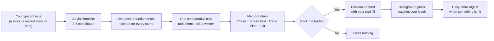
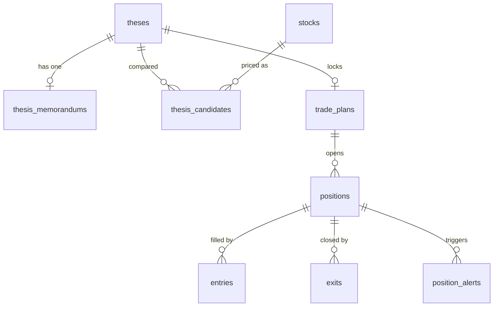

<p align="center">
  
</p>

<h1 align="center">Jarvis Decision Cockpit</h1>

<p align="center">
  <em>Turn a plain-English trading thesis into a full investment memorandum.</em>
</p>

<p align="center">
  <a href="https://github.com/harshf15-code/Myticker/actions/workflows/ci.yml"></a>
  <a href="LICENSE"></a>
  
  
</p>

---

You give it a thesis in plain English — *"NBFCs have all-time-low NPAs, I think they run
this year"* — and it returns a complete investment memorandum: every candidate priced and
compared head-to-head, a winner, four ways the trade could fail, a costed trade plan, and
the exit rules. Then it watches the market and emails you when a level is hit.

> **This is decision support, not a broker.** It never places an order, never touches a
> brokerage account, and never moves money. It is not investment advice. Every number it
> produces comes from a language model and should be treated as a starting point for your
> own judgement, not an answer. See [Disclaimer](#disclaimer).

---

## What it actually does

Most "AI trading" tools either give you a chat window or a black-box signal. This does
neither. It runs a fixed analytical workflow — thesis → stress test → trade plan → exit
discipline — and makes the model show its work at every step.

**The core loop:**



The key design decision: **you never pick from a list of names the system hasn't
analysed.** A macro thesis gets a basket Jarvis chooses and prices. A thesis that already
names a stock gets that stock *plus its closest peers* — because "should I buy this one"
is only answerable against the alternatives.

### The memorandum

One screen, four tabs, produced in a single pass:

| Tab | Contains |
|---|---|
| **Thesis** | Market view, the mispricing, catalysts, *why not the others* (per-peer teardown), time horizon and invalidation, conviction score, secondary pick |
| **Stress Test** | Four concrete failure modes, each paired with an honest counter-argument — and a verdict on whether the bear case holds |
| **Trade Plan** | Nine-cell grid (CMP, entry zone, add tranche, stop, two targets, size, horizon, time exit), a thesis test calendar, and an optional parallel entry |
| **Exit** | Five sequenced rules (trim, trim, runner, hard stop, time exit), the one *anchor metric* to track, and risk/reward, max drawdown, tier and PEG |

Above them sits a comparative grid: up to five names side by side with live price,
valuation multiple, 52-week range position, market cap, and a BUY/WATCH/AVOID call.

### After you back a trade

Backing a trade records your **actual fill** — price, quantity, date — not the entry zone
the model proposed. From there the app tracks the position, computes weighted-average
entry across tranches, logs exits, and keeps a trade journal so you can review whether
the thesis was right for the reasons you thought.

Two Supabase Edge Functions run on `pg_cron`:

- **`poll-prices`** — refreshes quotes during market hours (NSE and US sessions handled
  separately), evaluates every active position's entry/stop/target/time levels, and
  writes alerts. De-duplicates so a persistently-breached stop doesn't spam you.
- **`daily-digest`** — once a day after the US close, emails everything unsent.

---

## Screens

| Route | What it is |
|---|---|
| `/` | Cockpit — portfolio state at a glance |
| `/thesis` | Every thesis you've run |
| `/thesis/[id]` | **The memorandum** |
| `/positions` · `/positions/[id]` | Open positions, entries, exits |
| `/feed` | Intelligence feed |
| `/journal` | Trade journal and post-mortems |
| `/discovery` | Opportunity discovery |
| `/recommendations` | Recommendation tracker — did Jarvis's calls actually work? |

---

## Quick start

**Prerequisites:** Node.js **22+** (`yahoo-finance2` requires it), a
[Supabase](https://supabase.com) project (free tier is fine), and an
[OpenRouter](https://openrouter.ai) API key.

```bash
git clone https://github.com/harshf15-code/Myticker.git
cd Myticker
npm install
cp .env.local.example .env.local
```

Fill in `.env.local` — every variable is documented in the example file:

| Variable | Where to get it |
|---|---|
| `NEXT_PUBLIC_SUPABASE_URL`, `NEXT_PUBLIC_SUPABASE_ANON_KEY`, `SUPABASE_SERVICE_ROLE_KEY` | Supabase → Settings → API |
| `SUPABASE_DB_URL` | Supabase → Settings → Database → Connection string (URI) |
| `OPENROUTER_API_KEY` | openrouter.ai → Keys |
| `OPENROUTER_MODEL_ID` | e.g. `anthropic/claude-sonnet-4.5` |
| `APP_PASSWORD` | Any password — this is the only thing gating the app |
| `SESSION_SECRET` | `openssl rand -base64 32` |

Apply the schema, in order:

```bash
for f in supabase/migrations/0*.sql; do
  node --env-file=.env.local scripts/apply-migration.mjs "$f"
done
```

> `0003_pg_cron_jobs.sql.example` is skipped by that glob on purpose — it is a template
> you edit and run by hand once, after deploying the Edge Functions.

Then:

```bash
npm run dev     # http://localhost:3000
```

Log in with `APP_PASSWORD`, click **New Thesis**, and type a thesis.

### Optional: background monitoring

Alerts and the daily digest need the Edge Functions deployed. Without them everything
else works — you just have to refresh prices by visiting a page.

```bash
supabase link --project-ref <your-project-ref>
supabase functions deploy poll-prices
supabase functions deploy daily-digest
supabase secrets set AGENTMAIL_API_KEY=... AGENTMAIL_INBOX_ID=... DIGEST_RECIPIENT_EMAIL=...
```

Then schedule them: copy `supabase/migrations/0003_pg_cron_jobs.sql.example`, fill in your
project ref, and run it in the SQL editor. It stores the service-role key in Supabase
Vault rather than inlining it into the cron definition.

---

## Architecture

```
app/
  (auth)/login/        Shared-password gate
  (app)/               Everything behind the gate
    thesis/[id]/       The memorandum
    positions/         Position tracking
  api/                 Route handlers — the only things that touch the DB
components/
  layout/              Header, icon rail, mobile nav, thesis drawer
  thesis/              Memorandum: comparative grid, four tabs, back-trade dialog
lib/
  jarvis-memorandum.ts     Memorandum schema + prompt + normalizer  ← start here
  jarvis-thesis-prompt.ts  Thesis structuring + candidate shortlist
  jarvis-thesis-parser.ts  Fenced-JSON extraction, trade-plan geometry
  market-data.ts           yahoo-finance2 wrapper (quotes, OHLCV, fundamentals)
  supabase/admin.ts        Service-role client — the only DB access path
supabase/
  migrations/          Schema, applied in numeric order
  functions/           Deno Edge Functions (poll-prices, daily-digest)
styles/tokens.css      Design tokens — the single source of colour
```

**Auth is deliberately minimal.** One shared password, one signed HS256 cookie
(`middleware.ts`). There are no user accounts because this is built to be run by one
person on their own data. Row-level security is enabled with *no policies* on every
table, so the anon key can read nothing; all access goes through the service-role client
behind the password gate.

### How the LLM pipeline stays honest

Language models are unreliable in specific, predictable ways. Three defences:

**1. Everything is parsed, never trusted.** Each prompt demands one trailing fenced JSON
block. `extractTrailingJsonBlock` takes the *last* match (so an echoed example can't win),
and a Zod schema validates it. Parsers never throw — a bad response degrades to a visible
error with the raw text preserved, never to silently-null data.

**2. Display strings and machine numbers are kept separate.** The memorandum carries both
`cells` (`"₹1,050–1,090"`, for humans) and `numeric` (`1050`, `1090`). Only `numeric` is
ever written to the database, so a formatted range can never be parsed into a stop-loss.

**3. Structural invariants are repaired, not assumed.** `normalizeMemorandum` enforces
exactly one primary pick agreeing with `primary_ticker`, and
`sanitizeTradePlanGeometry` drops any level that contradicts the plan — a stop above the
entry zone, a target below it, a `target_2` under `target_1`. A dropped cell is safer than
a plausible-looking number nobody checked.

Thin sections degrade individually: if the model returns nonsense for `catalysts`, that
field becomes `[]` and the rest of the memo survives.

### Data model



`thesis_memorandums.document` is one validated JSONB blob rather than forty columns: it is
produced and replaced atomically by a single model call and only ever read whole. It is
re-validated on read, so a row written by an older schema degrades to "re-run this"
instead of crashing the page.

---

## Testing

```bash
npm test          # vitest, no network or API keys needed
npm run lint
npx tsc --noEmit
```

Tests cover the parts where being wrong is expensive: JSON extraction, schema validation
and graceful degradation, trade-plan geometry, weighted-average entry maths, risk/reward
calculations, and market-hours logic across timezones and DST boundaries.

There are no tests that call the live model — those cost money and are non-deterministic.
The prompts are exercised manually.

---

## Deploying

Designed for [Vercel](https://vercel.com), but it is a standard Next.js app and will run
anywhere Node does.

```bash
npx vercel
```

**`.env.local` is never uploaded — it is gitignored, and Vercel does not read it.** Every
variable has to be set again in your hosting provider's dashboard, or the deployment will
look broken in confusing ways:

| Missing variable | What you see |
|---|---|
| `APP_PASSWORD` | Login rejects the correct password with "Incorrect password." |
| `SESSION_SECRET` | Same — the password matches but no session can be minted |
| `SUPABASE_SERVICE_ROLE_KEY` | Login works, every page is empty or errors |
| `OPENROUTER_API_KEY` | Everything loads, running a thesis fails |
| `NEXT_PUBLIC_SITE_URL` | Falls back to `VERCEL_URL` automatically; only needed on a custom domain |

The user-facing login error is deliberately generic so it can't be used to probe a
deployment, but each of these logs a specific `[config]` line to the server. If login is
refusing a password you know is right, check your runtime logs first:

```bash
vercel env ls           # what is actually set, per environment
vercel logs <url>       # look for [config] lines
```

Remember to redeploy after adding variables — they are baked in at build time.

The Edge Functions and their cron schedules live on Supabase and deploy separately.

### There are no user accounts

This is worth being explicit about, because it surprises people. Authentication is **one
shared password**, not a login system:

- There is no sign-up, no username, no per-user data. The login screen asks for a password
  and nothing else.
- Anyone with the password sees and can edit **the same** theses, positions and journal.
  A second person logging in is not a second account — it is the same workspace.

That is a deliberate fit for the intended use (one trader, own data, private URL). If you
want someone else to try it without touching your book, **deploy a second instance with
its own Supabase project** — no code change, complete separation.

Turning this into genuine multi-tenant software means real work: accounts, a `user_id` on
every table, Supabase RLS policies, and a data migration. It is not a config flag.

---

## Tech stack

Next.js 16 (App Router) · React 19 · TypeScript · Tailwind CSS v4 · Supabase (Postgres +
Deno Edge Functions) · Vercel AI SDK via OpenRouter · yahoo-finance2 · Zod · jose ·
lightweight-charts · Vitest

Design tokens come from a [Google Stitch](https://stitch.withgoogle.com) project and live
in `styles/tokens.css`. Never hardcode a colour outside that file.

---

## Disclaimer

This software is provided for informational and educational purposes only. It does not
constitute investment advice, financial advice, trading advice, or a recommendation to
buy or sell any security. The analysis it produces is generated by a large language model
and **may be confidently wrong**. Market data comes from an unofficial Yahoo Finance
endpoint and may be delayed, incorrect, or unavailable.

You are solely responsible for your own trading decisions and for any losses you incur.
Nothing here is a substitute for a licensed financial advisor. Do your own research.

---

## License

[MIT](LICENSE)
